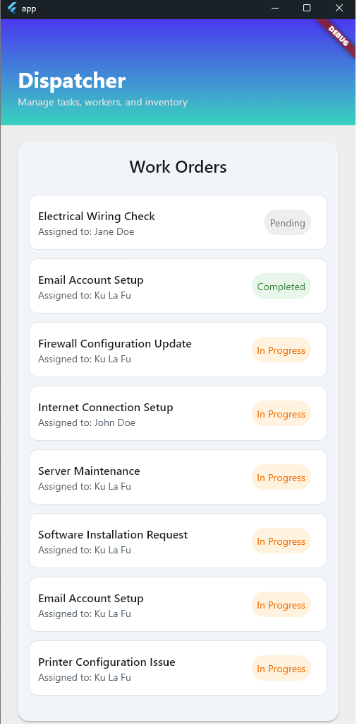
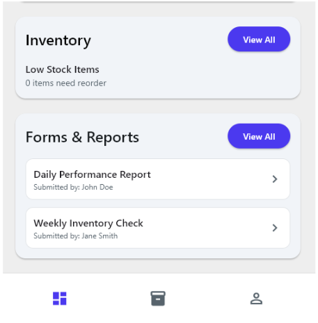
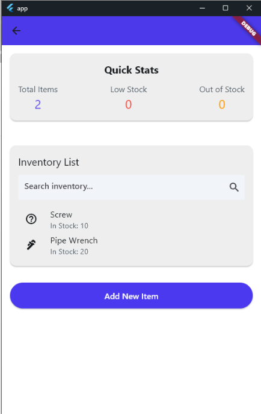
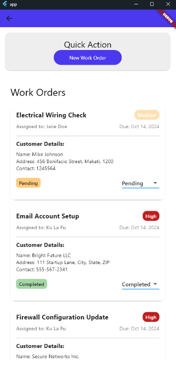
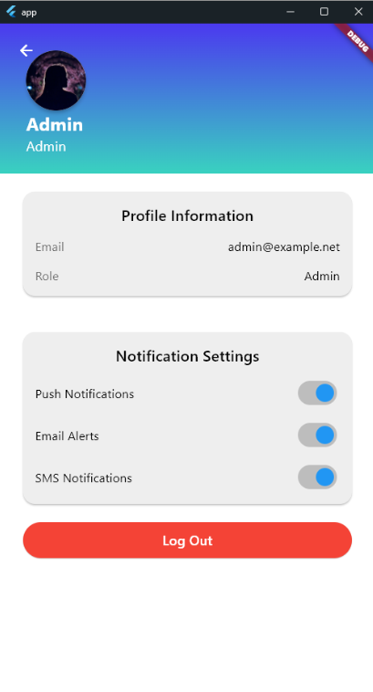
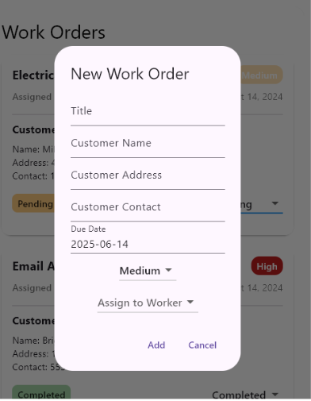
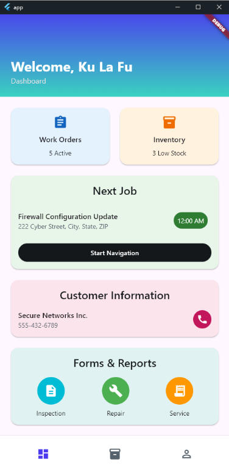
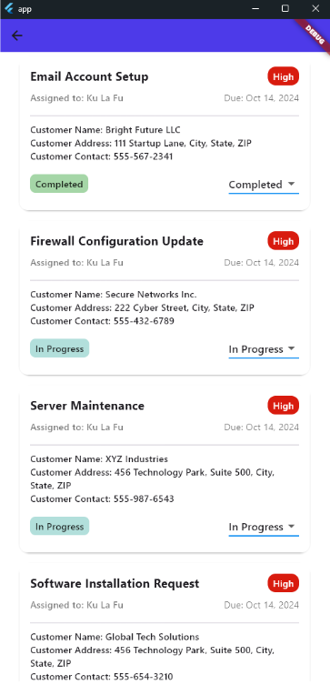
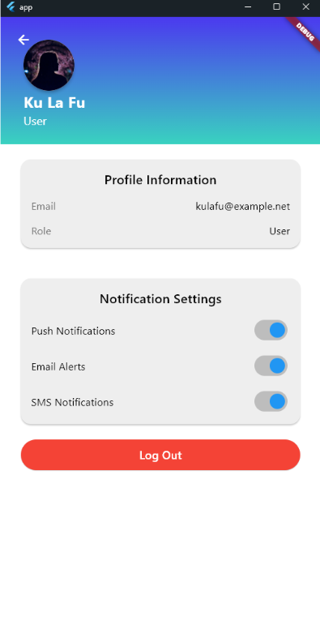

# techServe
# 🔧 TechServe: Tech Service Management App

**TechServe** is a mobile application designed to manage technical service requests by **efficiently processing user issues** and **matching tasks with specialists** based on their expertise.  
Built using **Flutter (Dart)**, the app offers a modern, responsive, and intuitive experience for both service requesters and tech specialists.

---

## 📲 Features

✅ **Technician Role**  
- View matched service requests based on expertise  
- Accept or decline tasks  
- Update task progress and mark as completed
- Track request status: *Pending*, *In Progress*, *Completed*  

✅ **Admin Role**  
- Manage user and technician accounts  
- Assign tasks manually (optional override)  
- View all requests and monitor technician performance

✅ **Push Notifications**  
- Notify users when request status changes  
- Notify technicians on new task assignment

---

## 🛠️ Technologies Used

| Component       | Technology          |
|------------------|----------------------|
| Framework        | **Flutter**          |
| Language         | Dart                 |
| Backend          | Firebase|
| Authentication   | Firebase Auth / Email & Password |
| Storage          | Firebase Firestore|

---
## ADMIN

## USER

